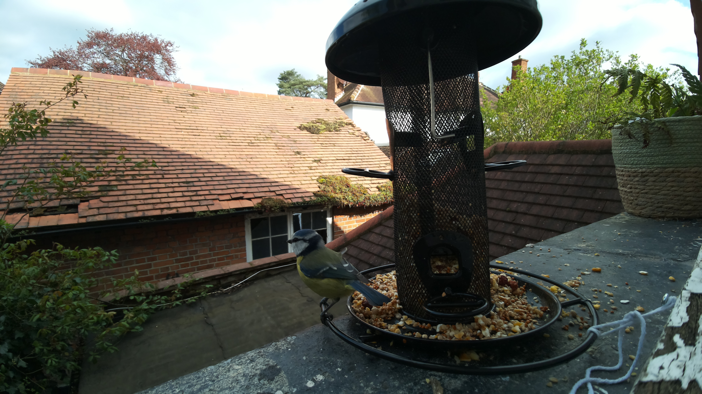

# 🦅 Raspberry Pi Bird Spotter

This is a javascript web server that is hosted on a Raspberry Pi Zero 2 W with a cammera attached to it.



A pretrained neural model is combined with the live video feed from the Pi to recognise objects (particularly birds) and save their photos to the memory.

Later on their photos are displayed on the web page that can be accessed from any browser.

## Table of Contents

- [🦅 Raspberry Pi Bird Spotter](#-raspberry-pi-bird-spotter)
  - [Table of Contents](#table-of-contents)
  - [Requirements](#requirements)
    - [Hardware](#hardware)
    - [Software](#software)
  - [Get started](#get-started)
    - [Install](#install)
    - [Known Issues](#known-issues)
    - [Run](#run)
    - [Known Issues](#known-issues-1)
      - [Systemctl](#systemctl)
  - [Credits](#credits)
  - [Bugs and Feedback](#bugs-and-feedback)
  - [License](#license)

## Requirements

Here you will find a short list of requirements for this project.

### Hardware

- Raspberry Pi
- Raspberry Pi Camera

### Software

- Raspberry Pi OS Lite

## Get started

First, copy this repository locally to your Pi.

### Install

Now you can install the required software:

```bash
./install.sh
```

### Known Issues

- During the instalation you might encounter an error message saying that process was terminated due to lack of memory. This is a known issue and this means that you dont have anough RAM to build the library and you can try to fix this by
creating a swap file as described here: https://askubuntu.com/a/796997.

> If you are running a different OS to the one specified or want to experiment with this project then you should modify the build stack.

### Run

After everything is set up without any errors you can
run the project locally:

```bash
node app.js
```

And open your browser window on: `http://<pi-ip>:3000`.

### Known Issues

Sometimes the child process running `libcamera-detect` might not stop when the web server is stopped. To fix this you can run the following command:

```bash
sudo killall libcamera-detect
```

#### Systemctl

As an alternative you can run this service via `systemctl`. Copy this repository to the `/home/pi` directory and copy the file `rpi_bird_watcher.service` to the `/etc/systemd/system` directory. Then run the following commands:

```bash
sudo systemctl daemon-reload
sudo systemctl enable rpi_bird_watcher.service
sudo systemctl start rpi_bird_watcher.service
```

## Credits

This project was developed by Markiian Benovskyi.

Favicon downloaded from Smashicons.

## Bugs and Feedback

For bugs, questions and discussions please use the Github Issues.

## License

GNU General Public License v3.0 provided in the LICENSE file.
Attribution is required by the license, please read it for more details.
